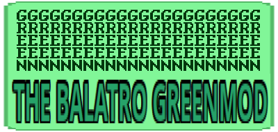

  

A mod focused around incrementally improving cards, by giving them the new enhancement, Green, which does nothing on its own but enables several powerful jokers.  
Made by a terrible artist, please excuse the visuals.  

## How to use
Follow the installation tutorial for steamodded: https://github.com/Steamodded/smods  
  
Click the code button then choose download zip to download this mod.  
Unzip to a folder, it won't work if you put the loose files straight in your mods folder.  
Then put the folder in your mods folder.  
It should look something like this:  

  
With the inside of the balatro-greenmod folder looking like this:  

